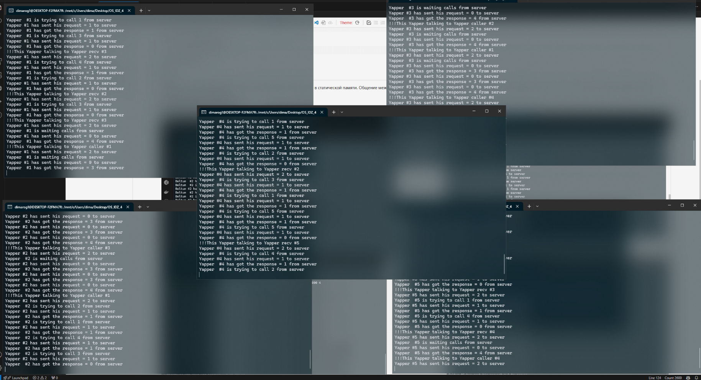

# Рогатнев Дмитрий Александрович БПИ 229 Вариант 23 (UDP)

## Условие задачи

Задача о болтунах. N болтунов имеют телефоны. Они либо некоторое (случайное) время ждут звонков, либо звонят друг другу, чтобы побеседовать. Если телефон случайного абонента занят, болтун будет звонить другому случайному абоненту, пока ему кто-нибудь не ответит. Побеседовав некоторое время, болтун или ждет звонка, или звонит на другой случайный номер.

Создать клиент–серверное приложение, моделирующее поведение болтунов. Каждый болтун — отдельный клиент. Сервер получает число болтунов при запуске и является коммутатором. Для автоматизации процесса запуск клиентов можно осуществлять скриптом. Также можно каждого клиента запускать вручную.

## Запуск программы

(Программа сделана для 5-ти болтунов)

Для запуска программы понадобится сначала скомпилировать файлы:

```shell
gcc -o server server.c
gcc -o client client.c
```

Далее запускается сервер:

```shell
./server 5000 5
```

И по отдельности каждый клиент:

```shell
./client 1 127.0.0.1 5000
```

И так все 5 клиентов.

## 4-5

Для каждого из клиентов создаётся свой потом, каждый хранит информацию в статической памяти. Общение между клиентом и сервером происходит с помощью сигналов. Call содержит id, caller_id и receiver_id. При запуске болтун ожидает звонка или звонит сам, повторяя эти действия.

### Примеры рабоы программы



Тут показан вывод программы.

## 6-7

Добавлен вывод информации о взаимодействии болтунов друг с другом на сервер. (Я решил не писать лишнюю программу для вывода всей информации о взаимодействиях на сервере, так как у меня уже присутствует удобный информативный вывод в программе сервера).

### Примеры рабоы программы

```txt
pulls have been initialized
Server listening...
Request code: 1
Yapper NUM: 0


Server listening...
Request code: 1
Yapper NUM: 1


Server listening...
Request code: 1
Yapper NUM: 0


Server listening...
Request code: 1
Yapper NUM: 2


Server listening...
Request code: 0
Yapper NUM: 3


Server listening...
Request code: 1
Yapper NUM: 1


Server listening...
Request code: 0
Yapper NUM: 4

Yapper #4 received call from Yapper 0
Yapper #4 received call from Yapper 1

Server listening...
Request code: 2
Yapper NUM: 4


Server listening...
Request code: 1
Yapper NUM: 0


Server listening...
Request code: 1
Yapper NUM: 2


Server listening...
Request code: 0
Yapper NUM: 3


Server listening...
Request code: 1
Yapper NUM: 1


Server listening...
Request code: 0
Yapper NUM: 4


Server listening...
Request code: 1
Yapper NUM: 0
```
